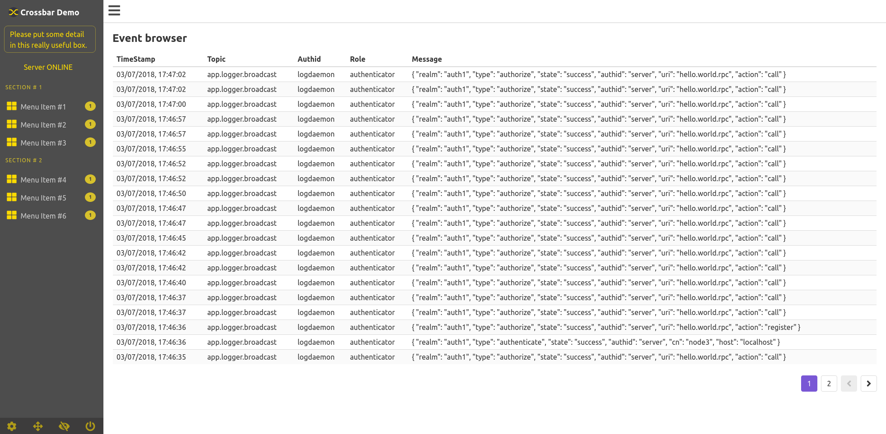

# IoT Starterkit Cookbook: **Applications**

 #### Smart Dispenser
 (TODO)
 
#### Generic Crossbar Application
This is designed to demonstrate how you might implement a small Crossbar based application and utilise some of the more advanced features including;

- Multiple Realms and Roles
- Multiple un-coupled dynamic authorizers / authenticators
- Centralised event logging
- Basic HA functionality
- A User Interface built with Autobahn, Vue.js and Bulma.

